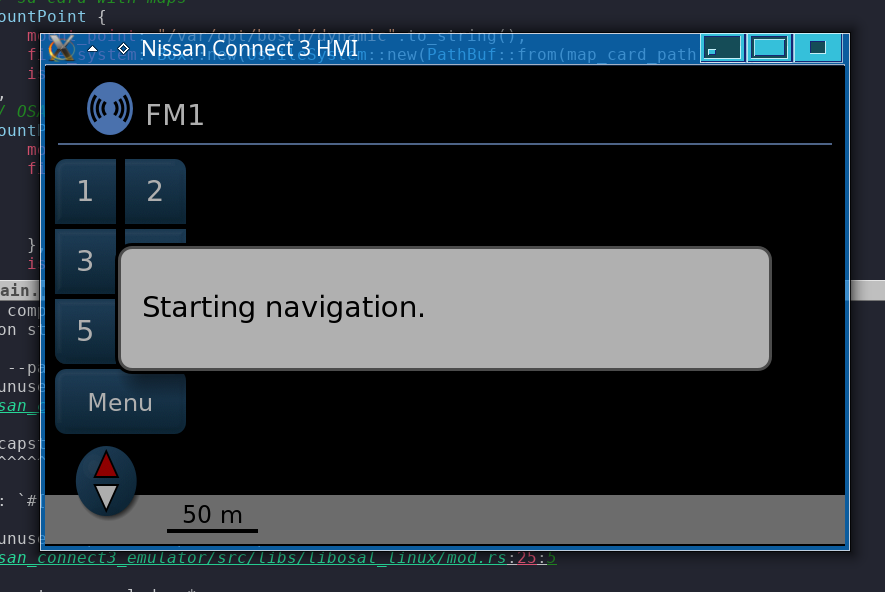

# Nissan Connect 3 Emulator

This project is an attempt to emulate and run firmware from Nissan Qashqai 2017. My aim is to be able to run Navigation application to help me verify navigation data hacks (finally I would like to be able to use OSM maps with Nissan Navigation system).

The OSM -> Bosch TravelMap converter project is here: https://github.com/marek-g/nissan_connect3_map_conv

Status: "Starting navigation." popup shows up and the emulation stucks there.


Special thanks to:
- https://github.com/ea/bosch_headunit_root (Rooting Bosch lcn2kai Headunit)
- https://github.com/ea/bosch_headunit_root/blob/main/docs/rtos_interaction.md (RTOS interaction)
- https://github.com/raburton/lcn-patcher
- https://github.com/sapphire-bt/lcn2kai-decompress

## Requirements

- `libunicorn` installed in the system

``` shell
sudo apt install libunicorn-dev
```
